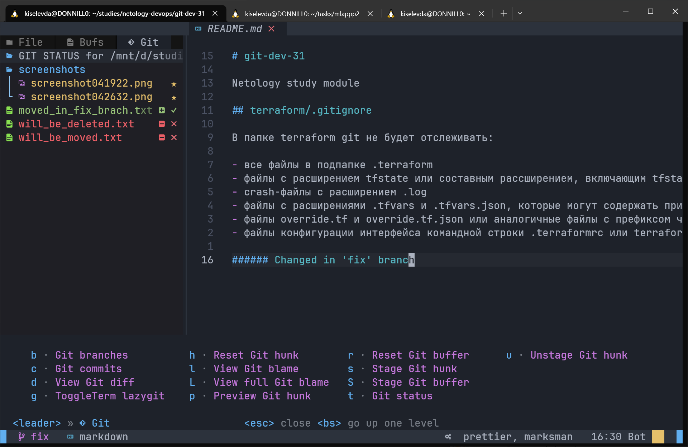
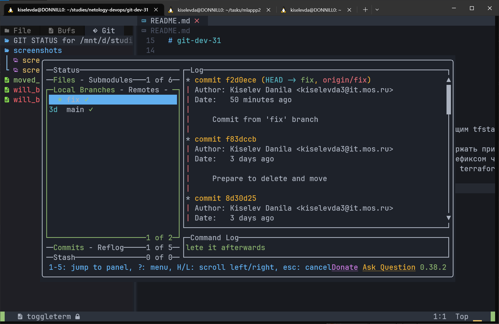

# git-dev-31

Netology study module

## terraform/.gitignore

В папке terraform git не будет отслеживать:

- все файлы в подпапке .terraform
- файлы с расширением tfstate или составным рассширением, включающим tfstate
- crash-файлы с расширением .log
- файлы с расширениями .tfvars и .tfvars.json, которые могут содержать приватные переменные
- файлы override.tf и override.tf.json или аналогичные файлы с префиксом через нижнее подчёркивание
- файлы конфигурации интерфейса командной строки .terraformrc или terraform.rc

###### На скриншотах ниже показан пример работы с git/lazygit в neovim

